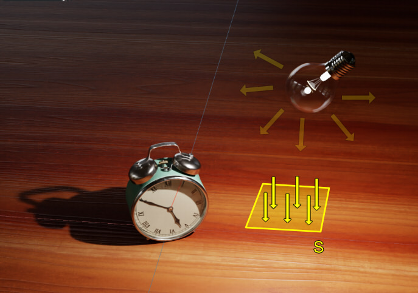
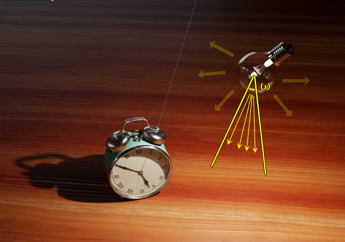
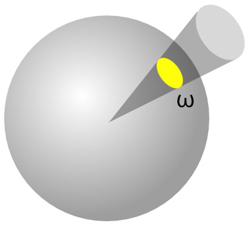
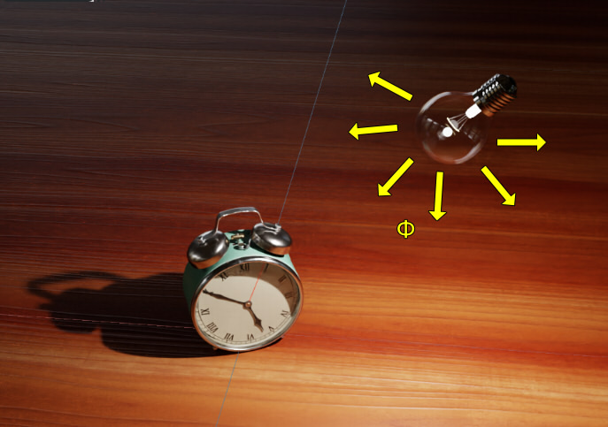
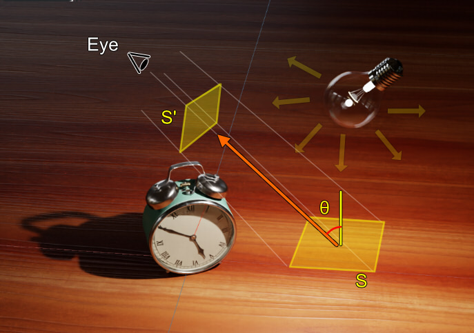
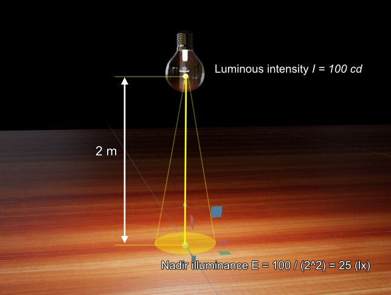
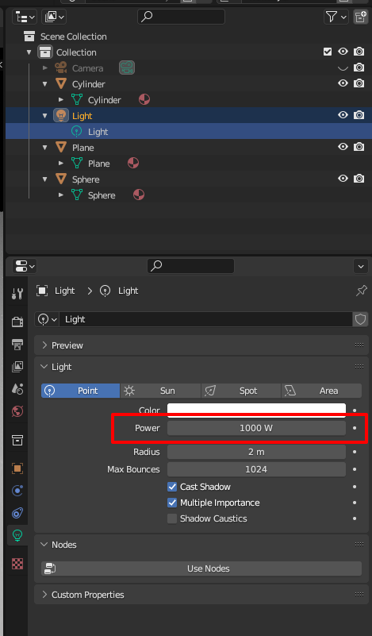
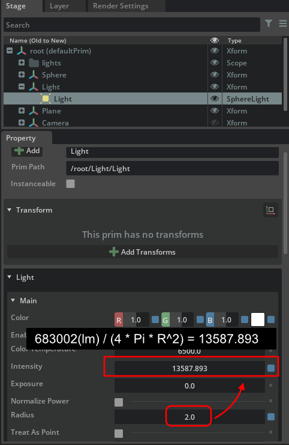
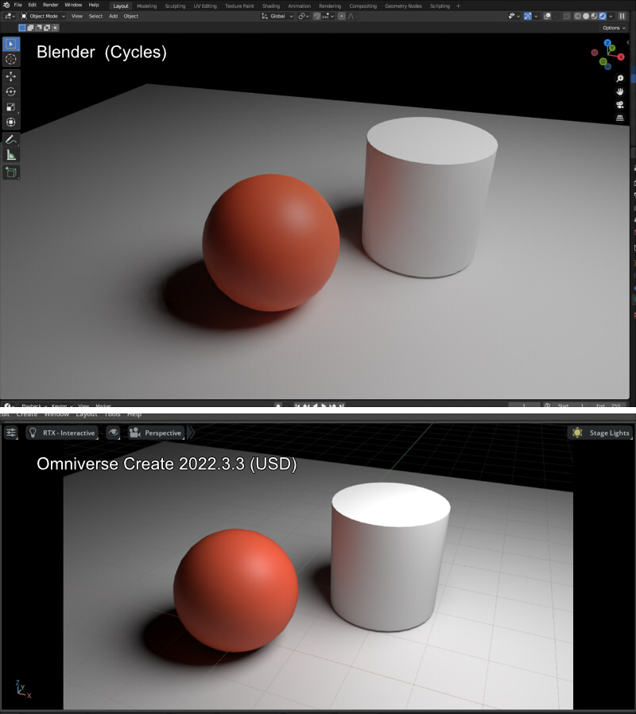
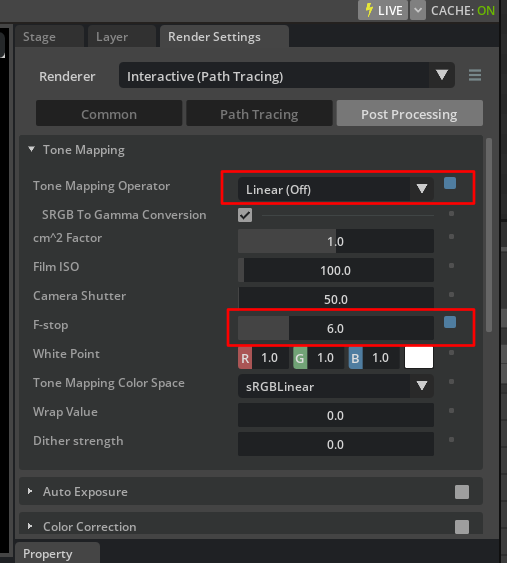

# Lighting Calculation

This section provides the information necessary for lighting calculations.     

## References

* https://tutorials.shade3d.jp/%e5%85%89%e6%ba%90%e3%81%a7%e4%bd%bf%e3%82%8f%e3%82%8c%e3%82%8b%e7%94%a8%e8%aa%9e-%e6%98%8e%e3%82%8b%e3%81%95%e3%81%ae%e5%8d%98%e4%bd%8d/post/6112
* https://tomari.org/main/java/hikari.html

## Lighting Unit

|Name|Unit|Description|     
|---|---|---|     
|Illuminance|Lux, lm/m^2|Incident brightness per unit area receiving light|     
|Luminous intensity|cd, lm/sr (sr=Steradian)|Amount of light emitted within a unit solid angle|     
|Luminous flux|lm|Amount of light per unit time; 4Pi*cd for omni-directional as in PointLight|     
|Luminance|cd/m^2, nit|Brightness per unit area viewed from a certain direction|     

### Illuminance

Illuminance is the brightness incident per unit area receiving light.      
The unit is "lux".     
     
When luminous flux is *phi* and area is *S* (unit is m^2), illuminance *E* can be calculated by the following equation.

> *E* = *phi* / *S*

### Luminous intensity

It refers to the amount of light emitted within a unit solid angle.    
The unit is "cd (candela)".    
     
When the luminous flux is *phi* and the solid angle is *omega* (unit is sr), the luminous intensity *I* can be calculated by the following equation.     

> *I* = *phi* / *omega*

The "solid angle" is not a two-dimensional angle, but a three-dimensional element.     
The area cut off from the conical surface of a sphere of radius 1.0 is called the solid angle.     
     
If all spheres of radius 1.0 are covered, the surface area of the sphere, "4 * Pi * R^2 = 4Pi", is the solid angle.     

When light is emitted, it is not a uniform luminous flux value in all directions; the intensity of the light may vary depending on the direction.     
Luminous intensity is used to describe this.
The term "light distribution" describes the distribution of luminous intensity.     

### Luminous flux

Luminous flux represents the amount of light per unit time.     
Since light has a direction, a light source such as a light bulb emits light radially.     
The unit is "lm (lumen)".    
     

### Luminance

Luminance represents the (apparent) brightness per unit area as seen from a certain direction.     
The unit is "cd/m^2".     
When the luminous intensity is *I* and the apparent area is *S'* (unit is m^2), the luminance *L* can be calculated by the following equation.    

> *L* = *I* / *S'*

The "apparent" unit area is the angle *Theta* that can be made in the line-of-sight direction to the normal of the light source or object surface, "*S'* = *S* * cos(*Theta*)".

     

For a diffuse reflective surface that is perfectly uniform for the angle of view (diffuse reflection distributed in a Lambertian hemisphere), the luminous intensity is "*I* * cos(*Theta*)" and the apparent area is "*S* * cos(*Theta*)",
In this case, the luminance does not change no matter which direction it is viewed from.     

Note that in the case of diffuse reflective surfaces or light distribution in the real world, luminous intensity will vary with angle.     
Therefore, luminance will vary depending on the angle of view.    

## Illuminance calculation

The nadir illuminance *E* (unit: lx) of a light of luminous intensity *I* (unit: cd) at a distance *R* (unit: m) can be calculated as follows.     

> *E* = *I* / (*R*^2)

The nadir illuminance is the illuminance at a position straight ahead from the light source at an angle of 0.    
If luminous intensity is 100 (cd) and distance is 2 (m), nadir illuminance is "100/(2^2) = 25".     

     

Illuminance is inversely proportional to the square of the distance.    
If the distance is 1 meter, then "100/(1^2) = 100," confirming that the closer to the light source, the brighter the light.    

## Conversion of luminous intensity, luminous flux, and illuminance

The following variables are provided.    

|Variable name|Unit|Description|     
|---|---|---|     
|*I*|cd, lm/sr|luminous intensity|     
|*Phi*|lm|luminous flux|     
|*E*|Lux, lm/m^2|illuminance|     
|*R*|m|Distance to light source|     
|*Angle*|degree|Illumination angle (0.0 - 360.0)|     

### Converts from luminous intensity to illuminance

> *E* = *I* / *R*^2

Conditions : For nadir illumination.     

### Converts from luminous intensity to luminous flux

> *Phi* = 2 * Pi * (1.0 - cos(Pi * (*Angle* / 360.0) ) * *I*)    

### Converts from luminous flux to luminous intensity

> *I* = *Phi* / (2 * Pi * (1.0 - cos(Pi * (*Angle* / 360.0))))     

### Converts from luminous flux to illuminance

> *I* = *Phi* / (2 * Pi * (1.0 - cos(Pi * (*Angle* / 360.0))))    
> *E* = *I* / *R*^2     

### Converts from illuminance to luminous intensity

> *I* = *E* * *R*^2    

### Converts from illuminance to luminous flux

> *I* = *E* * *R*^2    
> *Phi* = 2 * Pi * (1.0 - cos(Pi * (*Angle* / 360.0))) * *I*     

## Calculate Intensity of SphereLight in Omniverse from Blender

The unit of SphereLight intensity in USD is nits.     
This represents luminance, which specifies the brightness per unit area.      
Therefore, as the radius of the SphereLight changes, the overall amount of light changes.      

### Irradiance : Light intensity units in Blender's Point Light

The intensity of light (Power) in Blender's Point Light is "W".    
     
This is a unit of Irradiance.     
Also, the radius of PointLight is set here to 2.0 (m).    

### Irradiance to illuminance conversion

This is converted to illuminance (Lux).    
The following is for reference.     

* https://cgbeginner.net/blender-cycles-physically-correct-brightness/
* https://en.wikipedia.org/wiki/Luminous_efficiency_function

> 1.000 W/m2 = 683.002 Lux    

If Power is 1000W in Blender, the following calculation was used to convert it to illuminance.      

> 1000 W = 1000 * 683.002 = 683002 Lux     

### Illuminance to luminous intensity conversion

This was taken as the nadir illuminance at a distance of 1(m).     
In this case, the luminous flux can be calculated as follows.    
Assume that the radiation is emitted from the entire sphere because it is PointLight.      

> *I* = *E* * *R*^2    

For R=1.0, *I* = *E* .    

683002 (Lux) was calculated to be 683002 (cd).     

### Luminous intensity to Luminance conversion

The final unit to be determined is nits, which is the same as cd/m^2.    

Luminance can be calculated by dividing the luminous flux by the surface area of a sphere of radius R.     

> *L* = *I* / *S'*    

683002 / (4 * Pi * R^2) = 683002 / 50.265482456 = 13587.893    

     

Note that this scene is multiplied by 100 in Root Prim.    
Also, the default scene unit for USD is cm.     
Therefore, the unit of Radius=2.0 is passed on as meters.     

The comparison between Blender and Omniverse (USD) was as follows.    
     

I adjusted the ToneMapping on the Omniverse Create side a little.     

Tone Mapping Operator : Aces => Linear (Off)     
F-stop : 5.0 => 6.0     

     
This is done to minimize differences in the effects of Post Processing.     
But I am not sure if it is correct to adjust F-stop.     

