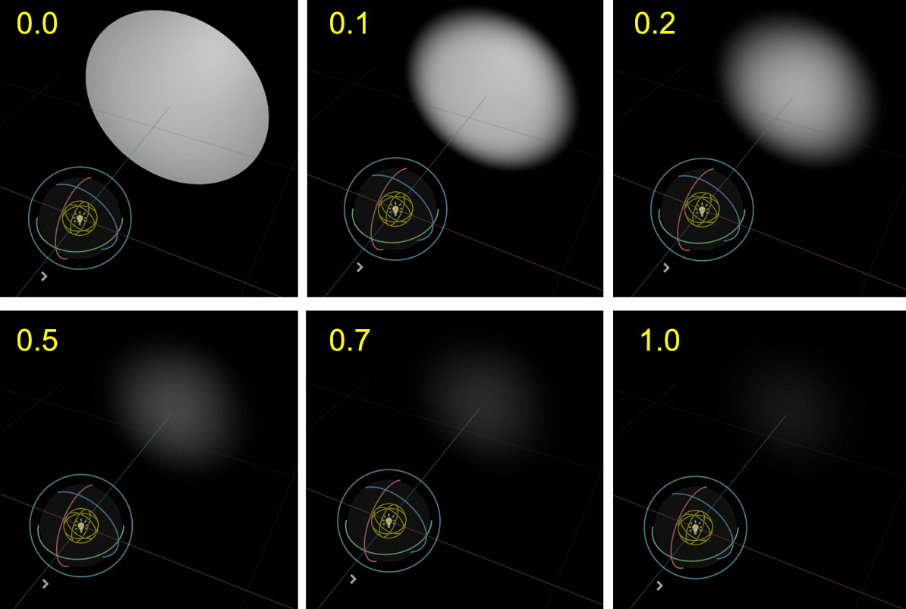

# Lights

## Light Orientation

In USD, RotateXYZ(0, 0, 0) will illuminate the lights in the -Z direction.      

    

    

In the usda file, the following is described.     
```
def DistantLight "DistantLight" (
    prepend apiSchemas = ["ShapingAPI"]
)
{
    float angle = 1
    float intensity = 3000
    float shaping:cone:angle = 180
    float shaping:cone:softness
    float shaping:focus
    color3f shaping:focusTint
    asset shaping:ies:file
    double3 xformOp:rotateXYZ = (0, 0, 0)
    double3 xformOp:scale = (1, 1, 1)
    double3 xformOp:translate = (0, 0, 0)
    uniform token[] xformOpOrder = ["xformOp:translate", "xformOp:rotateXYZ", "xformOp:scale"]
}
```

## SpotLight

SpotLight can be expressed by specifying the angle with "shaping:cone:angle" of SphereLight.     
In the usda file, the following is described.     
```
def SphereLight "SphereLight" (
    prepend apiSchemas = ["ShapingAPI"]
)
{
    float intensity = 300000
    float radius = 10
    float shaping:cone:angle = 30
    float shaping:cone:softness = 0.2
    float shaping:focus
    color3f shaping:focusTint
    asset shaping:ies:file
    double3 xformOp:rotateXYZ = (0, 0, 0)
    double3 xformOp:scale = (1, 1, 1)
    double3 xformOp:translate = (0, 0, 0)
    uniform token[] xformOpOrder = ["xformOp:translate", "xformOp:rotateXYZ", "xformOp:scale"]
}
```
    
The default value for "shaping:cone:angle" is 180.0. In this case, the light radiates in all directions.      

### Cone Softness

Varying Cone Softness from 0.0 to 1.0 gives a gradation inside the Cone Angle.    
    

The calculation to USD softness with outer and inner angles is as follows (Approximate calculation).     
    

```
Softness = (Outer - Inner) / 90.0
```
Outer : 0.0 - 90.0      
Inner : 0.0 - 90.0      
Outer &gt;= Inner     


Inner angle and Outer angle can be calculated from Angle(Outer angle) and Softness as follows.      

```
Outer = Angle
Inner = max(Angle - (Softness * 90.0), 0.0)
```

