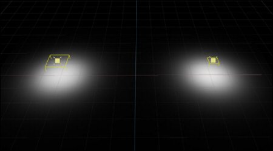

# Lights

## Light Orientation

In USD, RotateXYZ(0, 0, 0) will illuminate the lights in the -Z direction.      

    

    

In the usda file, the following is described.     
```
def DistantLight "DistantLight" (
    prepend apiSchemas = ["ShapingAPI"]
)
{
    float inputs:angle = 1
    float inputs:intensity = 3000
    float inputs:shaping:cone:angle = 180
    float inputs:shaping:cone:softness
    float inputs:shaping:focus
    color3f inputs:shaping:focusTint
    asset inputs:shaping:ies:file
    double3 xformOp:rotateXYZ = (0, 0, 0)
    double3 xformOp:scale = (1, 1, 1)
    double3 xformOp:translate = (0, 0, 0)
    uniform token[] xformOpOrder = ["xformOp:translate", "xformOp:rotateXYZ", "xformOp:scale"]
}
```

## SpotLight

SpotLight can be expressed by specifying the angle with "shaping:cone:angle" of SphereLight.     
In the usda file, the following is described.     
```
def SphereLight "SphereLight" (
    prepend apiSchemas = ["ShapingAPI"]
)
{
    float inputs:intensity = 300000
    float inputs:radius = 10
    float inputs:shaping:cone:angle = 30
    float inputs:shaping:cone:softness = 0.2
    float inputs:shaping:focus
    color3f inputs:shaping:focusTint
    asset inputs:shaping:ies:file
    double3 xformOp:rotateXYZ = (0, 0, 0)
    double3 xformOp:scale = (1, 1, 1)
    double3 xformOp:translate = (0, 0, 0)
    uniform token[] xformOpOrder = ["xformOp:translate", "xformOp:rotateXYZ", "xformOp:scale"]
}
```
    
The default value for "shaping:cone:angle" is 180.0. In this case, the light radiates in all directions.      

### Cone Softness

Varying Cone Softness from 0.0 to 1.0 gives a gradation inside the Cone Angle.    
    

The calculation to USD softness with outer and inner angles is as follows (Approximate calculation).     
    

```
Softness = (Outer - Inner) / 90.0
```
Outer : 0.0 - 90.0      
Inner : 0.0 - 90.0      
Outer &gt;= Inner     


Inner angle and Outer angle can be calculated from Angle(Outer angle) and Softness as follows.      

```
Outer = Angle
Inner = max(Angle - (Softness * 90.0), 0.0)
```

## From SphereLight to PointLight

In 3DCG, PointLight, which has no surface area, may be used.     
Note, however, that in the real world there are no lights that have no surface area.      

There is no PointLight in USD that does not have a surface area.      
To simulate PointLight from SphereLight, use the surface area of the sphere.     

*I* : Light intensity      
*R* : Radius of Sphere Light      

The formula for the surface area of a sphere is 4 * PI * *R*^2.     

From *I* and *R*, the light intensity is calculated to be the same even if the radius is changed.     

*I* = 30000, *R* = 20, This was used as the base value here.      
This is the surface area of a sphere of radius 20.     
```
4 * PI * R^2 = 4 * PI * 20^2 = 1600 * PI
```

Change the radius to 50 and calculate the same amount of light emitted from SphereLight at this time.     
Light Intensity is inversely proportional to the surface area of the sphere.     

```
4 * PI * 50^2 = 10000 * PI
I' = ((1600 * PI) / (10000 * PI)) * I = (1600 / 10000) * 30000 = 4800
```

Change the radius of the sphere to 100 and recalculate.     
```
4 * PI * 100^2 = 40000 * PI
I'' = ((1600 * PI) / (40000 * PI)) * I = (1600 / 40000) * 30000 = 1200
```

This is the calculation of light intensity at "[point_light.usda](../samples/light/point_light.usda)".     
     

The amount of light received on the ground is the same for different radii of SphereLight.     

### Calculate intensity at PointLight

In this case, the radius of SphereLight can be reduced to get closer to PointLight.      

*I* = 30000, *R* = 20, Using this as a base, calculate the intensity at a radius of 1.0.    

```
4 * PI * 1^2 = 4 * PI
I''' = ((1600 * PI) / (4 * PI)) * I = (1600 / 4) * 30000 = 12000000
```

This is as follows.     
     
In Omniverse RTX-Real-Time, there were cases where SphereLight's Radius could be smaller than 1.0 without any impact.     

In Omniverse RTX-Interactive, the SphereLight radius can be smaller than 1.0 (cm), but in that case, it seems that "Treat As Point" needs to be On.     
     

### Hard Shadow with SphereLight

In both RTX-Real-Time and RTX-Interactive, the shadows were kept hard by setting "Treat As Point" in SphereLight to On.     
     


## RectLight

In the usda file, RectLight is described as follows.     

```
def RectLight "RectLight_100x100_Intensity_15000" (
    prepend apiSchemas = ["ShapingAPI"]
)
{
    float inputs:width = 100
    float inputs:height = 100
    float inputs:intensity = 15000
    float inputs:shaping:cone:angle = 180
    float inputs:shaping:cone:softness
    float inputs:shaping:focus
    color3f inputs:shaping:focusTint
    asset inputs:shaping:ies:file
    double3 xformOp:rotateXYZ = (-90, 0, 0)
    double3 xformOp:scale = (1, 1, 1)
    double3 xformOp:translate = (-400, 100, 0)
    uniform token[] xformOpOrder = ["xformOp:translate", "xformOp:rotateXYZ", "xformOp:scale"]
}
```
The width and height specify the size of the RectLight.     
The area can be calculated by width * height.     
The larger the area, the greater the illuminance, even if the intensity is the same.    

The following usda adjusted the overall illumination to be the same for RectLight with different width x height.      

[rect_light.usda](../samples/light/rect_light.usda)     
```
def RectLight "RectLight_100x100_Intensity_15000" (
    prepend apiSchemas = ["ShapingAPI"]
)
{
    float inputs:width = 100
    float inputs:height = 100
    float inputs:intensity = 15000
    float inputs:shaping:cone:angle = 180
    float inputs:shaping:cone:softness
    float inputs:shaping:focus
    color3f inputs:shaping:focusTint
    asset inputs:shaping:ies:file
    double3 xformOp:rotateXYZ = (-90, 0, 0)
    double3 xformOp:scale = (1, 1, 1)
    double3 xformOp:translate = (-400, 100, 0)
    uniform token[] xformOpOrder = ["xformOp:translate", "xformOp:rotateXYZ", "xformOp:scale"]
}

def RectLight "RectLight_50x50_Intensity_60000" (
    prepend apiSchemas = ["ShapingAPI"]
)
{
    float inputs:width = 50
    float inputs:height = 50
    float inputs:intensity = 60000
    float inputs:shaping:cone:angle = 180
    float inputs:shaping:cone:softness
    float inputs:shaping:focus
    color3f inputs:shaping:focusTint
    asset inputs:shaping:ies:file
    double3 xformOp:rotateXYZ = (-90, 0, 0)
    double3 xformOp:scale = (1, 1, 1)
    double3 xformOp:translate = (400, 99.99999999999737, 0)
    uniform token[] xformOpOrder = ["xformOp:translate", "xformOp:rotateXYZ", "xformOp:scale"]
}
```
      

"RectLight_100x100_Intensity_15000" is the size of RectLight in 100 x 100(cm).     
intensity = 15000.      

For a 50 x 50(cm) RectLight, given the same brightness conditions, itensity can be calculated as follows.     
```
15000 * ((100 * 100) / (50 * 50)) = 60000
```
Intensity can be calculated relative to the inverse proportion of area.    


## SphereLight Intensity

