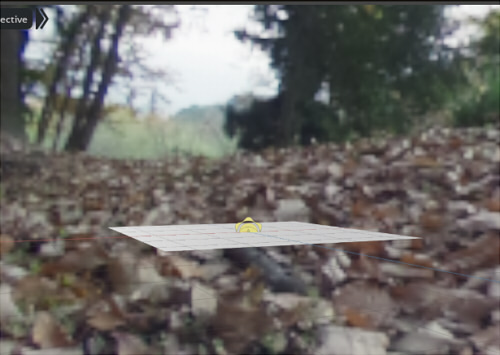

# USD Samples

This includes materials using MDLs that are compatible with NVIDIA Omniverse.      

## What USD ?

Pixar has defined a file format called "Universal Scene Description (USD)".     
https://graphics.pixar.com/usd/release/index.html

USD is more than a file format; it also acts as a framework for defining 3D scenes.     

## USD samples

I have decided to create a sample of USD files by function.     

### defaultPrim

|File|Material Type|Description|      
|---|---|---|      
|[not_used_defaultPrim.usda](samples/defaultPrim/not_used_defaultPrim.usda)|OmniPBR|Do not use defaultPrim |      
|[use_defaultPrim.usda](samples/defaultPrim/use_defaultPrim.usda)|OmniPBR|Use of defaultPrim |      

### Hierarchy

|File|Material Type|Description|      
|---|---|---|      
|[MultipleRoots.usda](samples/hierarchy/MultipleRoots.usda)|OmniPBR|Scene with more than one root. Also, defaultPrim is not specified. |      

### metersPerUnit

|File|Material Type|Description|      
|---|---|---|      
|[unit_test_cm.usda](samples/metersPerUnit/unit_test_cm.usda)|OmniPBR|Placement of 1 meter plane. Stage unit is cm (default.metersPerUnit=0.01). |      
|[unit_test_m.usda](samples/metersPerUnit/unit_test_m.usda)|OmniPBR|Placement of 1 meter plane. Stage unit is m (metersPerUnit=1.0). |      
|[unit_test_mm.usda](samples/metersPerUnit/unit_test_mm.usda)|OmniPBR|Placement of 1 meter plane. Stage unit is mm (metersPerUnit=0.001). |      

### Up Axis

|File|Material Type|Description|      
|---|---|---|      
|[UpAxis_Y.usda](samples/UpAxis/UpAxis_Y.usda)|OmniPBR|Up axis Y. |      
|[UpAxis_Z.usda](samples/UpAxis/UpAxis_Z.usda)|OmniPBR|Up axis Z. |      

### Primitive

|File|Material Type|Description|      
|---|---|---|      
|[simple_primitives.usda](samples/primitive/simple_primitives.usda)|-|Placement of Cube,Sphere,Cylinder,Capsule,Cone |      

### Curves

|File|Material Type|Description|      
|---|---|---|      
|[basisCurves.usda](samples/curves/basisCurves.usda)|-|BasisCurves |      

### Light

|File|Material Type|Description|      
|---|---|---|      
|[point_light.usda](samples/light/point_light.usda)|-|Point Light with Sphere Light. Use the ratio of radius to surface area to achieve the same light intensity |      
|[spot_light.usda](samples/light/spot_light.usda)|-|Spot Light with Sphere Light. Change in Cone Angle and Cone Softness. |      
|[rect_light.usda](samples/light/rect_light.usda)|-|Rect Light. Adjusts the ratio of RectLight area to intensity so that the same amount of light is produced for different sizes. |      
|[dome_light.usda](samples/light/dome_light.usda)|OmniPBR|DomeLight. |      

### doubleSided

|File|Material Type|Description|      
|---|---|---|      
|[doubleSided.usda](samples/doubleSided/doubleSided.usda)|UsdPreviewSurface|DoubleSided. |      

### Variant

|File|Material Type|Description|      
|---|---|---|      
|[VariantTest.usda](samples/variant/VariantTest.usda)|OmniPBR|Use Variant. Switch chairs.  Shapes and textures are called from external sources.|      

### PointInstancer

|File|Material Type|Description|      
|---|---|---|      
|[point_instancer_01.usda](samples/PointInstancer/point_instancer_01.usda)|UsdPreviewSurface|PointInstancer. |      

### Skeleton

|File|Material Type|Description|      
|---|---|---|      
|[jointTest.usda](samples/Skeleton/jointTest.usda)|OmniPBR|Skin + Joint. |      

### Reference, Payload

|File|Material Type|Description|      
|---|---|---|      
|[simple_mesh_sphere_reference.usda](samples/reference/simple_mesh_sphere_reference.usda)|OmniPBR|Refer to [simple_mesh_sphere_reference.usda](samples/reference/simple_mesh_sphere_reference.usda) to [simple_mesh_sphere.usda](samples/reference/simple_mesh_sphere.usda) |      
|[simple_mesh_sphere_payload_nest.usda](samples/reference/simple_mesh_sphere_payload_nest.usda)|OmniPBR|Refer with Payload to two levels. [simple_mesh_sphere_payload_nest.usda](samples/reference/simple_mesh_sphere_payload_nest.usda) [simple_mesh_sphere_payload.usda](samples/reference/simple_mesh_sphere_payload.usda) [simple_mesh_sphere.usda](samples/reference/simple_mesh_sphere.usda) |      
|[payload_use_primPath.usda](samples/reference/payload_use_primPath.usda)|OmniPBR|Specify PrimPath when doing Payload. Refer to [payload_use_primPath.usda](samples/reference/payload_use_primPath.usda) to [refObjects.usda](samples/reference/refObjects.usda) |      

### Instance

|File|Material Type|Description|      
|---|---|---|      
|[instance_test.usda](samples/instance/instance_test.usda)|-|Use Instance. |      

### Mesh

|File|Material Type|Description|      
|---|---|---|      
|[simpleCube.usda](samples/mesh/simpleCube.usda)|-|Mesh Cube. normal and UV with interpolation=faceVarying. |      
|[simpleCubeVertex.usda](samples/mesh/simpleCubeVertex.usda)|-|Mesh Cube. normal and UV with interpolation=vertex. |      
|[concave_polygons.usda](samples/TriangulationOfPolygon/concave_polygons.usda)|UsdPreviewSurface|Triangulation of polygons. Below is the display in Unity.  This sample is not correctly triangulated even with Omniverse Create 2022.3.|      
|[easyChair_01.usdc](samples/TriangulationOfPolygon/easyChair_01.usdc)|UsdPreviewSurface|Triangulation of polygons. Below is the display in Unity.  This sample is not correctly triangulated even with Omniverse Create 2022.3.|      
|[simpleCubeSubdivision.usda](samples/mesh/simpleCubeSubdivision.usda)|-|Mesh Cube with Subdivision. Use faceVarying with normal and UV. |      
|[primvars_normals.usda](samples/mesh/primvars_normals.usda)|OmniPBR|Normals are specified with "primvars:normals". |      

### Material

UsdPreviewSurface.    

|File|Material Type|Description|      
|---|---|---|      
|[UsdPreviewSurface.usda](samples/Material/UsdPreviewSurface/UsdPreviewSurface.usda)|UsdPreviewSurface|DiffuseColor only. |      
|[UsdPreviewSurface_texture.usda](samples/Material/UsdPreviewSurface/UsdPreviewSurface_texture.usda)|UsdPreviewSurface|DiffuseColor Texture. |      
|[UsdPreviewSurface_multiply_texture.usda](samples/Material/UsdPreviewSurface/UsdPreviewSurface_multiply_texture.usda)|UsdPreviewSurface|DiffuseColor multiply texture. Use inputs:scale. |      
|[UsdPreviewSurface_transform.usda](samples/Material/UsdPreviewSurface/UsdPreviewSurface_transform.usda)|UsdPreviewSurface|DiffuseColor texture with UsdTransform2d. Use inputs:translation, inputs:scale. |      
|[UsdPreviewSurface_transform_rotate.usda](samples/Material/UsdPreviewSurface/UsdPreviewSurface_transform_rotate.usda)|UsdPreviewSurface|DiffuseColor texture with UsdTransform2d. Use inputs:translation, inputs:scale, inputs:rotation. |      
|[UsdPreviewSurface_opacity.usda](samples/Material/UsdPreviewSurface/UsdPreviewSurface_opacity.usda)|UsdPreviewSurface|Use inputs:opacity.  Rendered in RTX-Real-Time. Render Settings-Real Time-Ray Tracing-Translucency-Enable Fractional Cutout Opacity : On|      
|[UsdPreviewSurface_opacityThreshold.usda](samples/Material/UsdPreviewSurface/UsdPreviewSurface_opacityThreshold.usda)|UsdPreviewSurface|Opacity Map, Normal Map. Use inputs:opacityThreshold. |      
|[UsdPreviewSurface_cyawan.usda](samples/Material/UsdPreviewSurface/UsdPreviewSurface_cyawan.usda)|UsdPreviewSurface|PBR Material. Use diffuseColor Map, Normal Map, Roughness Map, Occlusion Map.  In NormnalMap, bias=(-1, -1, -1, 0), scale=(2, 2, 2, 1).|      
|[UsdPreviewSurface_vertexColor.usda](samples/Material/UsdPreviewSurface/UsdPreviewSurface_vertexColor.usda)|UsdPreviewSurface|Vertex Color Supported by USDView, Omniverse RTX (USD Composer 2023.1.1 Beta). |      
|[UsdPreviewSurface_vertexColorFaces.usda](samples/Material/UsdPreviewSurface/UsdPreviewSurface_vertexColorFaces.usda)|UsdPreviewSurface|Vertex Color Supported by USDView, Omniverse RTX (USD Composer 2023.1.1 Beta). |      
|[UsdPreviewSurface_emissive_texture.usda](samples/Material/UsdPreviewSurface/UsdPreviewSurface_emissive_texture.usda)|UsdPreviewSurface|Use emissiveColor Texture. |      
|[UsdPreviewSurface_clearcoat.usda](samples/Material/UsdPreviewSurface/UsdPreviewSurface_clearcoat.usda)|UsdPreviewSurface|Use clearcoat, clearcoatRoughness. |      
|[UsdPreviewSurface_clearcoat_with_texture.usda](samples/Material/UsdPreviewSurface/UsdPreviewSurface_clearcoat_with_texture.usda)|UsdPreviewSurface|Use clearcoat(with texture), clearcoatRoughness. |      
|[UsdPreviewSurface_clearcoat_with_texture2.usda](samples/Material/UsdPreviewSurface/UsdPreviewSurface_clearcoat_with_texture2.usda)|UsdPreviewSurface|Use clearcoat(with texture), clearcoatRoughness(with texture). |      

OmniPBR.    

|File|Material Type|Description|      
|---|---|---|      
|[UsdPreviewSurfaceAndOmniPBR.usda](samples/Material/OmniPBR/UsdPreviewSurfaceAndOmniPBR.usda)|OmniPBR|DiffuseColor only. Comparison of UsdPreviewSurace and OmniPBR, where DIffuseColor is stored as "Linear".|      
|[OmniPBR_cyawan.usda](samples/Material/OmniPBR/OmniPBR_cyawan.usda)|OmniPBR|AlbedoMap, RoughnessMap, NormalMap, and OcclusionMap in OmniPBR. |      
|[OmniPBR_opacity.usda](samples/Material/OmniPBR/OmniPBR_opacity.usda)|OmniPBR|Use Opacity.  Rendered in RTX-Real-Time. Render Settings-Real Time-Ray Tracing-Translucency-Enable Fractional Cutout Opacity : On|      
|[OmniPBR_opacityThreshold.usda](samples/Material/OmniPBR/OmniPBR_opacityThreshold.usda)|OmniPBR|Use OpacityMap. Specify "mono_alpha" in Opacity Mono Source. |      
|[OmniPBR_multiply_texture.usda](samples/Material/OmniPBR/OmniPBR_multiply_texture.usda)|OmniPBR|DiffuseColor multiply texture. |      
|[OmniPBR_emissive_intensity.usda](samples/Material/OmniPBR/OmniPBR_emissive_intensity.usda)|OmniPBR|Use Emissive. Comparison of emissive_intensity. |      
|[OmniPBR_emissive_texture.usda](samples/Material/OmniPBR/OmniPBR_emissive_texture.usda)|OmniPBR|Use emissiveColor Texture. |      

### DisplayColor      
|File|Material Type|Description|      
|---|---|---|      
|[displayColor.usda](samples/DisplayColor/displayColor.usda)|---|Set DisplayColor of single color. |      
|[displayColor_VertexColor.usda](samples/DisplayColor/displayColor_VertexColor.usda)|---|Set the vertex color with DisplayColor.  Works with Omniverse RTX, USDView.|      
|[displayColor_VertexColorFaces.usda](samples/DisplayColor/displayColor_VertexColorFaces.usda)|---|Set the vertex color with DisplayColor. For each face.  Works with Omniverse RTX, USDView.|      

### Points (Point Clouds)

|File|Material Type|Description|      
|---|---|---|      
|[PointClouds.usda](samples/PointClouds/PointClouds.usda)|---|Point Clouds.  Supported by USDView. Omniverse RTX does not reflect DisplayColor to the point.|      

### Display Name

The specified DisplayName is used as the Prim name in the UI display.     
DisplayName is not bound by any single-byte alphanumeric character or name prefix constraints.     

|File|Material Type|Description|      
|---|---|---|      
|[DisplayName.usda](samples/DisplayName/DisplayName.usda)|---|When UTF-8 Japanese is specified as DisplayName.  Supported by USDView. DisplayName in Japanese (UTF-8) in Omniverse can be optionally displayed, but the font must be specified. This will be kept private.|      
|[DisplayName_english.usda](samples/DisplayName/DisplayName_english.usda)|---|When English is specified as DisplayName.  In the Stage window, select "Show Display Names" from the Options menu and set it to On.|      

### Layer

|File|Material Type|Description|      
|---|---|---|      
|[layer1.usda](samples/Layer/layer1.usda)|UsdPreviewSurface|sublayer_sphere.usda of the sublayer from layer1.usda. |      
|[layer1_override.usda](samples/Layer/layer1_override.usda)|UsdPreviewSurface|sublayer_sphere.usda of the sublayer from layer1_override.usda. Also, an override was performed in layer1_override.usda. |      

### Kind

|File|Material Type|Description|      
|---|---|---|      
|[kind.usda](samples/kind/kind.usda)|---|Use kind. |      

## Knowledges

* [Color space : Interconversion between sRGB and Linear(raw)](./knowledges/ColorSpaceConversion.md)
* [Lights](./knowledges/Lights.md)
* [Lighting Calculation](./knowledges/LightingCalculation.md)
* Camera

----

