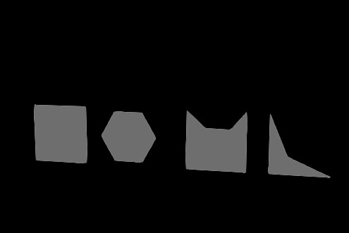

USD samples.     
This includes materials using MDLs that are compatible with NVIDIA Omniverse.      

## What USD ?

Pixar has defined a file format called "Universal Scene Description (USD)".     
https://graphics.pixar.com/usd/release/index.html

USD is more than a file format; it also acts as a framework for defining 3D scenes.     

## USD samples

I have decided to create a sample of USD files by function.     

### defaultPrim

|File|Material Type|Description|      
|---|---|---|      
|[not_used_defaultPrim.usda](samples/defaultPrim/not_used_defaultPrim.usda)|OmniPBR|Do not use defaultPrim |      
|[use_defaultPrim.usda](samples/defaultPrim/use_defaultPrim.usda)|OmniPBR|Use of defaultPrim |      

### Hierarchy

|File|Material Type|Description|      
|---|---|---|      
|[MultipleRoots.usda](samples/hierarchy/MultipleRoots.usda)|OmniPBR|Scene with more than one root. Also, defaultPrim is not specified. |      

### metersPerUnit

|File|Material Type|Description|      
|---|---|---|      
|[unit_test_cm.usda](samples/metersPerUnit/unit_test_cm.usda)|OmniPBR|Placement of 1 meter plane. Stage unit is cm (default.metersPerUnit=0.01). |      
|[unit_test_m.usda](samples/metersPerUnit/unit_test_m.usda)|OmniPBR|Placement of 1 meter plane. Stage unit is m (metersPerUnit=1.0). |      
|[unit_test_mm.usda](samples/metersPerUnit/unit_test_mm.usda)|OmniPBR|Placement of 1 meter plane. Stage unit is mm (metersPerUnit=0.001). |      

### Primitive

|File|Material Type|Description|      
|---|---|---|      
|[simple_primitives.usda](samples/primitive/simple_primitives.usda)|-|Placement of Cube,Sphere,Cylinder,Capsule,Cone |      

### Curves

|File|Material Type|Description|      
|---|---|---|      
|[basisCurves.usda](samples/curves/basisCurves.usda)|-|BasisCurves |      

### Light

|File|Material Type|Description|      
|---|---|---|      
|[point_light.usda](samples/light/point_light.usda)|-|Point Light with Sphere Light. Use the ratio of radius to surface area to achieve the same light intensity |      
|[spot_light.usda](samples/light/spot_light.usda)|-|Spot Light with Sphere Light. Change in Cone Angle and Cone Softness. |      
|[dome_light.usda](samples/light/dome_light.usda)|OmniPBR|DomeLight. |      

### doubleSided

|File|Material Type|Description|      
|---|---|---|      
|[doubleSided.usda](samples/doubleSided/doubleSided.usda)|UsdPreviewSurface|DoubleSided. |      

### Variant

|File|Material Type|Description|      
|---|---|---|      
|[VariantTest.usda](samples/variant/VariantTest.usda)|OmniPBR|Use Variant. Switch chairs.  Shapes and textures are called from external sources.|      

### PointInstancer

|File|Material Type|Description|      
|---|---|---|      
|[point_instancer_01.usda](samples/PointInstancer/point_instancer_01.usda)|UsdPreviewSurface|PointInstancer. |      

### Skeleton

|File|Material Type|Description|      
|---|---|---|      
|[jointTest.usda](samples/Skeleton/jointTest.usda)|OmniPBR|Skin + Joint. |      

### Reference, Payload

|File|Material Type|Description|      
|---|---|---|      
|[simple_mesh_sphere_reference.usda](samples/reference/simple_mesh_sphere_reference.usda)|OmniPBR|Refer to [simple_mesh_sphere_reference.usda](samples/reference/simple_mesh_sphere_reference.usda) to [simple_mesh_sphere.usda](samples/reference/simple_mesh_sphere.usda) |      
|[simple_mesh_sphere_payload_nest.usda](samples/reference/simple_mesh_sphere_payload_nest.usda)|OmniPBR|Refer with Payload to two levels. [simple_mesh_sphere_payload_nest.usda](samples/reference/simple_mesh_sphere_payload_nest.usda) [simple_mesh_sphere_payload.usda](samples/reference/simple_mesh_sphere_payload.usda) [simple_mesh_sphere.usda](samples/reference/simple_mesh_sphere.usda) |      

### Instance

|File|Material Type|Description|      
|---|---|---|      
|[instance_test.usda](samples/instance/instance_test.usda)|-|Use Instance. |      

### Mesh

|File|Material Type|Description|      
|---|---|---|      
|[simpleCube.usda](samples/mesh/simpleCube.usda)|-|Mesh Cube. normal and UV with interpolation=faceVarying. |      
|[simpleCubeVertex.usda](samples/mesh/simpleCubeVertex.usda)|-|Mesh Cube. normal and UV with interpolation=vertex. |      
|[concave_polygons.usda](samples/TriangulationOfPolygon/concave_polygons.usda)|UsdPreviewSurface|Triangulation of polygons. Below is the display in Unity.  This sample is not correctly triangulated even with Omniverse Create 2022.3.|      
|[easyChair_01.usdc](samples/TriangulationOfPolygon/easyChair_01.usdc)|UsdPreviewSurface|Triangulation of polygons. Below is the display in Unity.  This sample is not correctly triangulated even with Omniverse Create 2022.3.|      
|[simpleCubeSubdivision.usda](samples/mesh/simpleCubeSubdivision.usda)|-|Mesh Cube with Subdivision. Use faceVarying with normal and UV. |      

### Material

UsdPreviewSurface.    

|File|Material Type|Description|      
|---|---|---|      
|[UsdPreviewSurface.usda](samples/Material/UsdPreviewSurface/UsdPreviewSurface.usda)|UsdPreviewSurface|DiffuseColor only. |      
|[UsdPreviewSurface_texture.usda](samples/Material/UsdPreviewSurface/UsdPreviewSurface_texture.usda)|UsdPreviewSurface|DiffuseColor Texture. |      
|[UsdPreviewSurface_multiply_texture.usda](samples/Material/UsdPreviewSurface/UsdPreviewSurface_multiply_texture.usda)|UsdPreviewSurface|DiffuseColor multiply texture. Use inputs:scale. |      
|[UsdPreviewSurface_transform.usda](samples/Material/UsdPreviewSurface/UsdPreviewSurface_transform.usda)|UsdPreviewSurface|DiffuseColor texture with UsdTransform2d. Use inputs:translation, inputs:scale. |      
|[UsdPreviewSurface_transform_rotate.usda](samples/Material/UsdPreviewSurface/UsdPreviewSurface_transform_rotate.usda)|UsdPreviewSurface|DiffuseColor texture with UsdTransform2d. Use inputs:translation, inputs:scale, inputs:rotation. |      
|[UsdPreviewSurface_opacity.usda](samples/Material/UsdPreviewSurface/UsdPreviewSurface_opacity.usda)|UsdPreviewSurface|Use inputs:opacity.  Opacity should be viewed with RTX-Interactive (Path Tracing).|      
|[UsdPreviewSurface_opacityThreshold.usda](samples/Material/UsdPreviewSurface/UsdPreviewSurface_opacityThreshold.usda)|UsdPreviewSurface|Opacity Map, Normal Map. Use inputs:opacityThreshold. |      
|[UsdPreviewSurface_cyawan.usda](samples/Material/UsdPreviewSurface/UsdPreviewSurface_cyawan.usda)|UsdPreviewSurface|PBR Material. Use diffuseColor Map, Normal Map, Roughness Map, Occlusion Map.  In Omniverse Create 2022.3 and USDView 22.11, the borders of the normal map are visible.|      

OmniPBR.    

|File|Material Type|Description|      
|---|---|---|      
|[UsdPreviewSurfaceAndOmniPBR.usda](samples/Material/OmniPBR/UsdPreviewSurfaceAndOmniPBR.usda)|OmniPBR|DiffuseColor only. Comparison of UsdPreviewSurace and OmniPBR, where DIffuseColor is stored as "Linear".|      
|[OmniPBR_multiply_texture.usda](samples/Material/OmniPBR/OmniPBR_multiply_texture.usda)|OmniPBR|DiffuseColor multiply texture. |      

----

