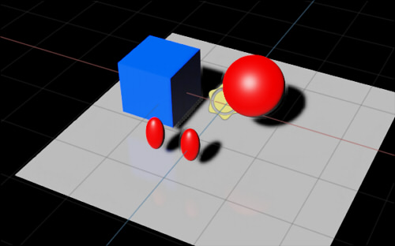

USD samples.     
This includes materials using MDLs that are compatible with NVIDIA Omniverse.      

## What USD ?

Pixar has defined a file format called "Universal Scene Description (USD)".     
https://graphics.pixar.com/usd/release/index.html

USD is more than a file format; it also acts as a framework for defining 3D scenes.     

## USD samples

I have decided to create a sample of USD files by function.     

### Primitive

|File|Material Type|Description|      
|---|---|---|      
|[simple_primitives.usda](samples/primitive/simple_primitives.usda)|-|Placement of Cube,Sphere,Cylinder,Capsule,Cone |      

### Curves

|File|Material Type|Description|      
|---|---|---|      
|[basisCurves.usda](samples/curves/basisCurves.usda)|-|BasisCurves |      

### Light

|File|Material Type|Description|      
|---|---|---|      
|[point_light.usda](samples/light/point_light.usda)|-|Point Light with Sphere Light. Use the ratio of radius to surface area to achieve the same light intensity |      
|[spot_light.usda](samples/light/spot_light.usda)|-|Spot Light with Sphere Light. Change in Cone Angle and Cone Softness. |      

### doubleSided

|File|Material Type|Description|      
|---|---|---|      
|[doubleSided.usda](samples/doubleSided/doubleSided.usda)|UsdPreviewSurface|DoubleSided. |      

### PointInstancer

|File|Material Type|Description|      
|---|---|---|      
|[point_instancer_01.usda](samples/PointInstancer/point_instancer_01.usda)|UsdPreviewSurface|PointInstancer. |      

### Skeleton

|File|Material Type|Description|      
|---|---|---|      
|[jointTest.usda](samples/Skeleton/jointTest.usda)|OmniPBR|Skin + Joint. |      

### Reference/Payload

|File|Material Type|Description|      
|---|---|---|      
|[simple_mesh_sphere_reference.usda](samples/reference/simple_mesh_sphere_reference.usda)|OmniPBR|Refer to [simple_mesh_sphere_reference.usda](samples/reference/simple_mesh_sphere_reference.usda) to [simple_mesh_sphere.usda](samples/reference/simple_mesh_sphere.usda) |      
|[simple_mesh_sphere_payload_nest.usda](samples/reference/simple_mesh_sphere_payload_nest.usda)|OmniPBR|Refer with Payload to two levels. [simple_mesh_sphere_payload_nest.usda](samples/reference/simple_mesh_sphere_payload_nest.usda) [simple_mesh_sphere_payload.usda](samples/reference/simple_mesh_sphere_payload.usda) [simple_mesh_sphere.usda](samples/reference/simple_mesh_sphere.usda) |      

----
